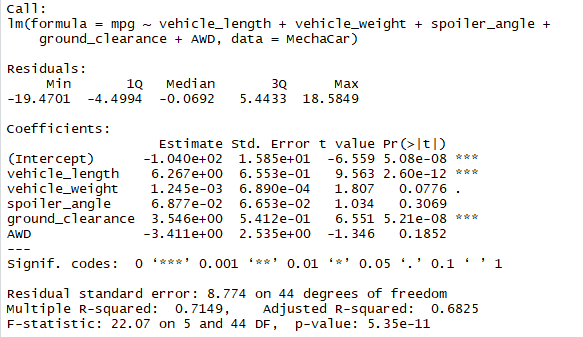
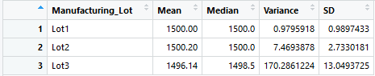
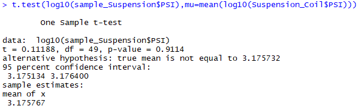
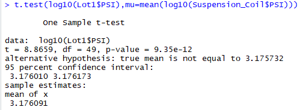
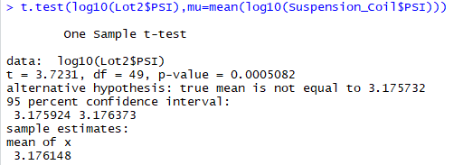
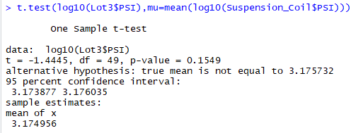

# MechaCar Statistical Analysis

## Linear Regression to Predict

- In the summary output, each Pr(>|t|) value represents the probability that each coefficient contributes a random amount of variance to the linear model. According to the results, vehicle_lenght and ground_clearance are statistically unlikely to provide random amounts of variance to the linear model. Vehicle_lenght and ground_clearance have a significant impact.

- The p-value of the linear regression analysis is 5.35e-11, which is much smaller than the assumed significance level of 0.05%. Therefore, it can state that there is sufficient evidence to reject the null hypothesis, which means that the slope of the linear model is NOT zero.

- This linear model does predict mpg of MecharCae prototypes in an effective manner. According to the calculated r-squared value = 0.715. Meaning that 71% of predictions will be correct when using this linear model.  

## Summary Statistics on Suspension

- The manufacturing data shows that for all lots, the design meets the specifications that must not exceed over the variance of the suspension coils of 100 PSI.
When the data is shown by lot, the story is different. The lots 1 and 2 meet the requirement with a Variance of 0.98 and 7.47, respectively. The variance for lot 3 shows 170.29, which is out of range for the specifications established. 

## T-Tests on Suspension Coils

- Assuming the significance level was the common 0.05 percent, the p-value = 0.91, is above our significance level. Therefore, we do not have sufficient evidence to reject the null hypothesis, and we would state that the two means are statistically similar.

- The p-value = 9.35e-12 is below the assumed significance level. Therefore,  there is enough evidence to reject the null hypothesis.

- The p-value = 0.0005082 is below the assumed significance level. Therefore,  there is enough evidence to reject the null hypothesis.

- The p-value = 0.1549 is below the assumed significance level. Therefore,  there is enough evidence to reject the null hypothesis.

